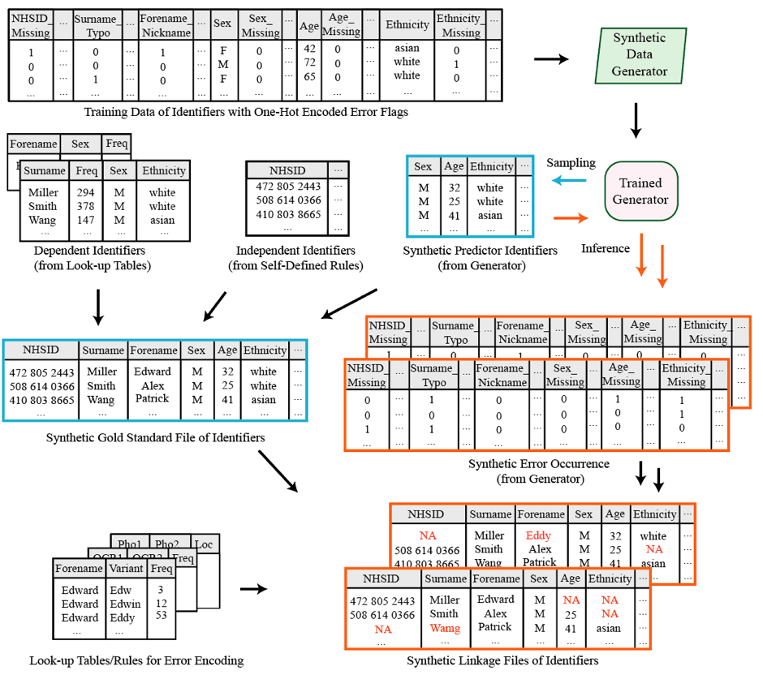

```{r setup, include=FALSE}
knitr::opts_chunk$set(echo = TRUE)
knitr::opts_knit$set(root.dir = '../') 
```


```{r results='hide', message=FALSE, warning=FALSE}
library(sdglinkage)
set.seed(1234)
```


Here we show how we can use **sdglinkage** to generate a realistic synthetic gold standard file and how to damage the gold standard file into mutiple copies of linkage files that can be used for linkage research. 

A gold standard file that gives us the true values of variables of interest, and linkage files that mimic the original error formats of real data. The following figure outlines the framework in generating these two types of files. In this example, we assume we have access to variables such as sex, age and ethnicity but not sensitive variables such as NHSID and names. We also assume to know the errors occurred in all variables We simulate three types of variables, which includes dependent variables learned together with the encoded error flags, external dependent variables and independent variables These generated synthetic variables are then merged into a gold standard file and further damaged by inferred synthetic errors, which give us synthetic linkage files.




# Generate Gold Standard File
Gold standard file consists of dependent variables and independent variables. In this section we should how we can generate synthetic dependent variables that we have access to and append them with synthetic external dependent variables and independent variables that we do not have access to. 


## Training Data with One-Hot Encoded Error Flags 
If we know where and what type of error had happened in the dataset, we would like to encode the position and type of error using one-hot encoding. For example, flag Edward's name variant error as '1' if his name record was typed as 'Eddy'. This gives us a training dataset with one-hot encoded error flags.

Bear in mind that we should build the error flags for all variables of interests, including independent variables - because even though the values of independent variables are independent of the values of other variables, the occurrence of errors of them can depend on the values or occurrence of errors of other variables For example, a person from a minority group is more likely to have a missing value in the NHSID variable than those were born in the UK. This results in a training dataset with many error flags together with the values of the dependent variables

In this subsection we show how to encode these error flags in case we do know have access to the error but have information about the error statistics. 
```{r}
# We use the 'age', 'race' and 'sex' variables from the 'Adult' dataset as an example of real dependent variables. Meanwhile, we know the statistics and errors consist in our target dataset. 

# adult_dataset = adult[c('age', 'race', 'sex')][1:1000,]
adult_dataset = adult[c('age', 'race', 'sex')]
adult_with_flag <- add_random_error(adult_dataset, prob = c(0.70, 0.30), "age_missing")
adult_with_flag <- add_random_error(adult_with_flag, prob = c(0.50, 0.50), "race_missing")
adult_with_flag <- add_random_error(adult_with_flag, prob = c(0.65, 0.35), "sex_missing")
adult_with_flag <- add_random_error(adult_with_flag, prob = c(0.95, 0.05), "postcode_missing")
adult_with_flag <- add_random_error(adult_with_flag, prob = c(0.65, 0.35), "firstname_variant")
adult_with_flag <- add_random_error(adult_with_flag, prob = c(0.65, 0.35), "lastname_variant")
adult_with_flag <- add_random_error(adult_with_flag, prob = c(0.65, 0.35), "firstname_typo")
adult_with_flag <- add_random_error(adult_with_flag, prob = c(0.65, 0.35),"firstname_pho")
adult_with_flag <- add_random_error(adult_with_flag, prob = c(0.65, 0.35), "firstname_ocr")
adult_with_flag <- add_random_error(adult_with_flag, prob = c(0.65, 0.35),"firstname_trans_char")

head(adult_with_flag)
```


## Generate Synthetic Dependent Variables from Existing Dataset
```{r}
# We use BNs to learn the dependency and parameters of the training dataset and sample data from the trained model. The generated data not only preserves the relationships and statistics between the variables, but also the occurance of errors (this is useful for the inference for linkage file that is introduced later). 
bn_learn <- gen_bn_learn(adult_with_flag, "hc")
syn_dependent <- bn_learn$gen_data[, !grepl("flag", colnames(bn_learn$gen_data))]
head(syn_dependent)
```


## Add Synthetic Independent Variables Following Rules
```{r}
# Here we randomly assign a nhsid and an address to an individual. nhsid is generated using the Modulus 11 Algorithm, and address is sampled from a real uk address database.
gold_standard <- add_variable(syn_dependent, "nhsid")
gold_standard <- add_variable(gold_standard, "address")
gold_standard$country <-NULL
gold_standard$primary_care_trust <-NULL
gold_standard$longitude <-NULL
gold_standard$latitude <-NULL
head(gold_standard)
```


## Add External Dependent Variables From Similar Real Datasets
```{r}
# Here we randomly assign a firstname and a lastname to an individual based on the value of gender and age and the frequency of the names. Firstname and lastname are sampled from a real uk database of baby birth name ranging from 1996 to 2018. 
gold_standard <- add_variable(gold_standard, "firstname", country = "uk", gender_dependency = TRUE, age_dependency = TRUE)
gold_standard <- add_variable(gold_standard, "lastname", country = "uk")
head(gold_standard)
```


# Generate Linkage Files
The linkage files are copies of gold standard file that were damaged by several damage actions. In this section we show how to generate two linkage files that can be used for linkage activity.

## Inference Mutiple Synthetic Error Occurrence Files
```{r}
# The error occurrence files are inferenced using the previously trained model based on the record of each individual. This gives us the guidenace of the damage actions. 
syn_error_occurrence_1 <- bn_flag_inference(bn_learn$gen_data, bn_learn$fit_model)
head(syn_error_occurrence_1)

syn_error_occurrence_2 <- bn_flag_inference(bn_learn$gen_data, bn_learn$fit_model)
head(syn_error_occurrence_2)
```


## Damage Gold Standard File According to The Error Occurrence
```{r}
# Here we damage the gold standard file based on the occurrence of the errors.
linkage_file_1 <- damage_gold_standard(gold_standard, syn_error_occurrence_1)
head(linkage_file_1$linkage_file)
head(linkage_file_1$error_log)

linkage_file_2 <- damage_gold_standard(gold_standard, syn_error_occurrence_2)
head(linkage_file_1$linkage_file)
```


# Use the Synthetic Linkage Files To Evaluate the Performance of Linkage Methods
Here we give an example how the generated linkage files can be used for linkage evaluation. 
```{r results='hide', message=FALSE, warning=FALSE}
library(reclin)
library(dplyr)
# 'postcode' is used as the blocking variable. 
linked_data_set <- pair_blocking(linkage_file_1$linkage_file, linkage_file_2$linkage_file, "postcode") %>%
  compare_pairs(by = c("lastname", "firstname", "sex", "race"),
                default_comparator = jaro_winkler(0.8)) %>%
  score_problink(var = "weight") %>%
  select_n_to_m("weight", var = "ntom", threshold = 0) %>%
  link()
```


```{r}
# This gives us the statistics of missed match
table(linked_data_set$nhsid.x == linked_data_set$nhsid.y)

# These are records of missed match
head(linked_data_set[linked_data_set$nhsid.x != linked_data_set$nhsid.y,],4)
```


